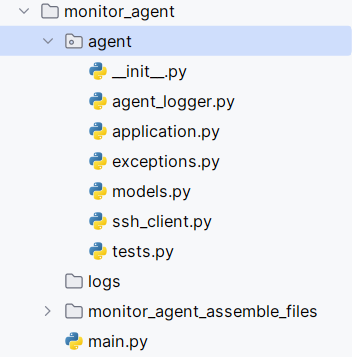
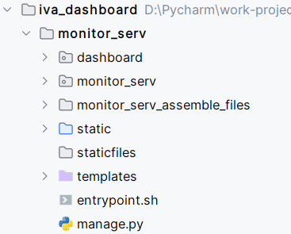

<h1>Приложение IVA-R-Dashboard</h1>

Created by pavelbeard

Введение:
  <ul>
    <li><a href="#from-which-includes">Из чего состоит?</a></li>
    <li>Как установить?</li>
    <li>Как пользоваться?</li>
  </ul>

    <h2>Из чего состоит?</h2>
    
Приложение состоит из 4 частей:

    <ol>
        <li>Агент мониторинга</li>
        <li>База данных</li>
        <li>Сервер инфопанели</li>
        <li>Сервер статических файлов <b>nginx</b></li>
    </ol>
    <h2>1. Агент мониторинга</h2>
    
Он включает в себя пакет <b>agent</b>, который, в свою очередь состоит
    из модулей:

    
Также в состав пакета <b>agent</b> входят модули:

    <ul>
        <li><b><i>application</i></b></li>
        <li><b><i>decorators</i></b></li>
        <li><b><i>exceptions</i></b></li>
        <li><b><i>models</i></b></li>
        <li><b><i>ssh_client</i></b></li>
        <li><b><i>tests</i></b></li>
    </ul>
    
Примерная структура сервиса в версии приложения <b>v0.5.1</b> выглядит так:

    
     
    <h3>Модуль application:</h3>
    
Состоит из приложения fastapi - <b>app</b>. Тут все просто. 
    Переменная распространяется на все модули сервиса и используется в качестве основы для API

    <h3>Модуль exceptions:</h3>
    
На данный момент в нем определено 
    одно исключение - NoConnectionWithServer. 
    Это класс, созданный для возбуждения исключения в том случае, 
    если нет соединения с целевыми серверами

    <h3>Модуль models:</h3>
    
Предназначен для определения моделей <b>pydantic</b>, 
    которые в свою очередь нужны для валидации входящих данных.
    В будущих версиях приложения будут определены модели.

    <h3>Модуль ssh_client:</h3>
    
В нем определен асинхронный метод <b>run_cmd_on_client</b>,  
    который запускает ssh-сессию и в ее рамках выполняет команды, посланные с сервера мониторинга, 
    а затем возвращает результат выполнения команды или команд.
    

    <h3>Модуль main:</h3>
    
Главный модуль, который содержит в себе точки терминации <b>fastapi</b>
    или проще говоря, <b>endpoint</b>, куда ссылаются другие приложения.
    Самый главный endpoint - <b>/api/monitor/metrics</b>. При обращении к этой части
    приложения запускается метод <b>run_cmd_on_client</b>, 
    который вытягивает метрики с серверов
    

    <h2>2. База данных</h2>
    
Важнейший элемент приложения. Без него не будут работать
    сервер инфопанели и <b>возможно, агент мониторинга (пока не знаю)</b>. Состоит
    из пакетов:

    <h2>3. Сервер инфопанели</h2>
    
Центральная часть всего проекта мониторинга серверов.
    Состоит приложения 
    из модулей:

<footer>
    
В приложении использовались иконки <b><a href="https://icons8.ru/">https://icons8.ru/</a></b>

</footer>