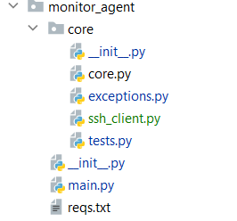

<h1>Приложение IVA-R-Dashboard</h1>

Created by pavelbeard

Введение:
  <ul>
    <li><a href="#from-which-includes">Из чего состоит?</a></li>
    <li>Как установить?</li>
    <li>Как пользоваться?</li>
  </ul>

    <h2>Из чего состоит?</h2>
    
Приложение состоит из 4 частей:

    <ol>
        <li>Агент мониторинга</li>
        <li>Сервер инфопанели</li>
        <li>База данных</li>
        <li>Скрипт, создающий файл known_hosts</li>
    </ol>
     
    
Само приложение контейнеризировано, состоит из независимых сервисов, 
    хотя скрипт не является таковым, но ему уделю отдельное внимание

    <h2>1. Агент мониторинга</h2>
    
Он включает в себя пакет <b>core</b>, который, в свою очередь состоит
    из модулей:

    
Также в состав пакета <b>core</b> входят модули:

    <ul>
        <li><b><i>core</i></b></li>
        <li><b><i>decorators</i></b></li>
        <li><b><i>exceptions</i></b></li>
        <li><b><i>ssh_client</i></b></li>
        <li><b><i>tests</i></b></li>
    </ul>
    
Примерная структура сервиса в версии приложения <b>v0.0.3</b> выглядит так:

    
     
    <h3>Модуль core:</h3>
    
Состоит из приложения fastapi - <b>app</b>. Тут все просто. 
    Переменная распространяется на все модули сервиса и используется в качестве основы для API

    <h3>Модуль exceptions:</h3>
    
На данный момент в нем определено 
    одно исключение - NoConnectionWithServer. 
    Это класс, созданный для возбуждения исключения в том случае, 
    если нет соединения с целевыми серверами

    <h3>Модуль ssh_client:</h3>
    
В нем определен асинхронный метод run_cmd_on_client,  
    который запускает ssh-сессию и в ее рамках выполняет команды, посланные с сервера мониторинга, 
    а затем возвращает результат выполнения команды или команд.

