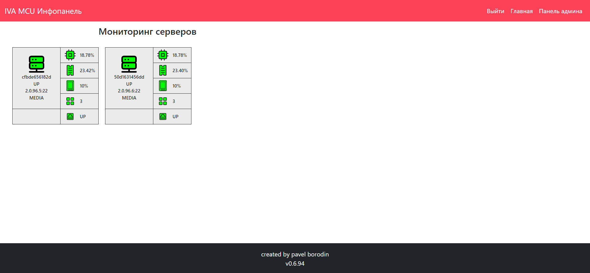
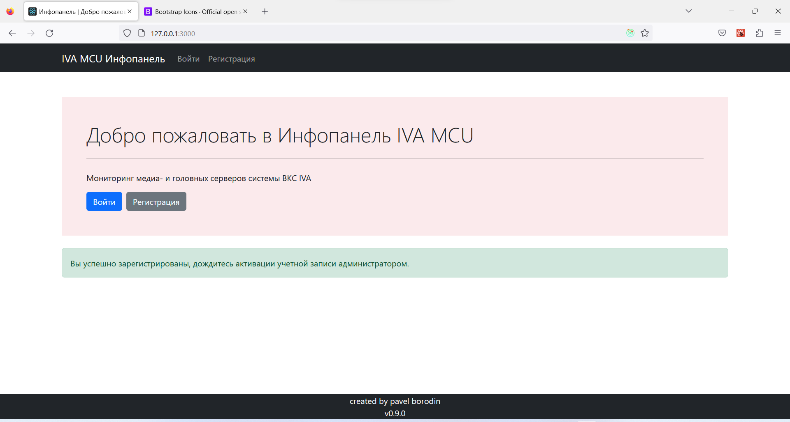

<h1 style="text-align: center">Приложение IVA MCU Dashboard</h1>

Created by pavelbeard
 v0.6.94

Введение:
  <ul>
    <li><a href="#about">Краткое описание</a></li>
    <li><a href="#howToInstall">Как установить?</a></li>
    <li>Как пользоваться?</li>
  </ul>

<h2>1. Краткое описание</h2>
    Сей веб-сервис используется для мониторинга системы ВКС IVA MCU.  
    
Главная страница выглядит так:
  
      
    На ней изображен мониторинг серверов IVA. На каждом сервере мониторятся:
    <ul>
        <li>Процессор</li>
        <li>ОЗУ</li>
        <li>Диски(виртуальные) и файловые системы</li>
        <li>Состояние потоков приложений и служб</li>
        <li>Состояние приложений и служб</li>
        <li>Состояние сетевых интерфейсов</li>
        <li>Мероприятия</li>
    </ul>
    В правой части панели отображен мониторинг журнала событий
    и возраст TLS сертификата 
     
     
    В будущем ожидается:
    <ul>
        <li>графики</li>
        <li>панель мероприятий</li>
        <li>панель лицензий</li>
        <li>панель пользователей IVA</li>
    </ul>

<h2>2. Как установить?</h2>

<ul>
    <li>Скачиваем репозиторий</li>
    <pre>
    wget https://github.com/pavelbeard/iva_dashboard_new
    </pre>
    <li>Заходим в папку iva_dashboard_new</li>
    <pre>
    cd iva_dashboard_new
    </pre>
    <li>Запускаем команду сборки docker-compose</li>
    <pre>
    docker-compose -f prod.docker-compose.yml up -d --build
</pre>
</ul>

 

<h2>3. Как использовать?</h2>
<ul>
    <li>Регистрируемся в системе
     
    
    </li>
    <li>
    Ожидаем активации вашего аккаунта администратором
     
    
    </li>
</ul>

<footer>
    
В приложении использовались иконки <b><a href="https://icons.getbootstrap.com/">Bootstrap icons</a></b>

</footer>