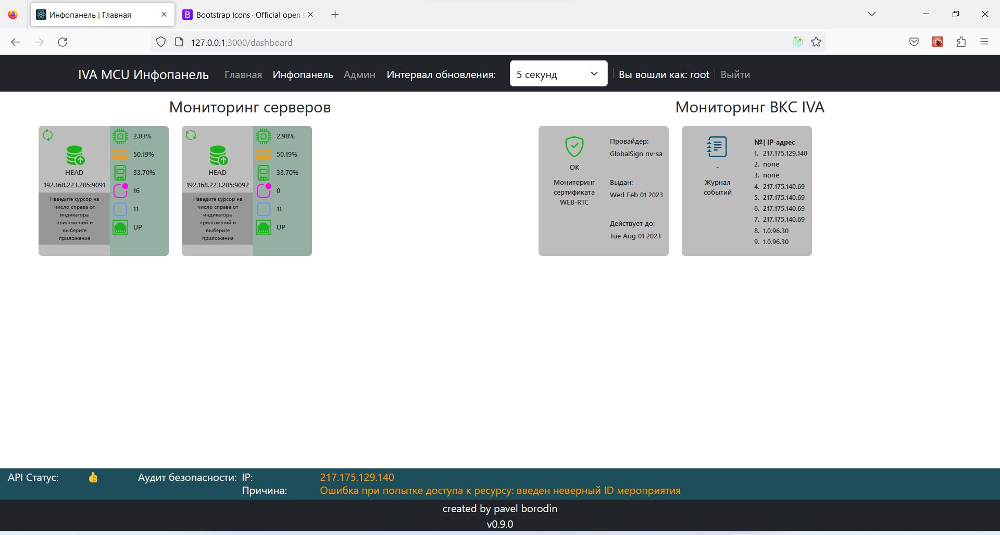
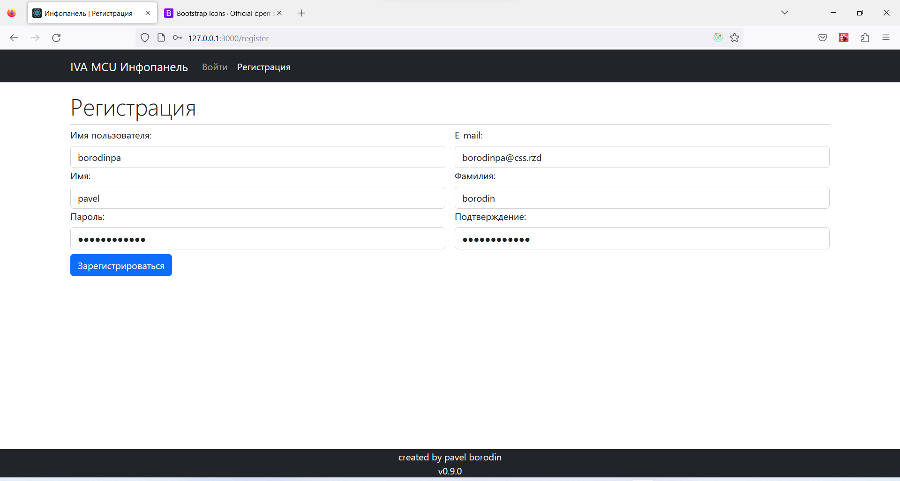

<h1 style="text-align: center">IVA MCU Dashboard Application</h1>

Created by pavelbeard
 v0.9.0

Introduction:
  <ul>
    <li><a href="#about">Brief Overview</a></li>
    <li><a href="#howToInstall">How to Install?</a></li>
    <li>How to Use?</li>
  </ul>

<h2>1. Brief Overview</h2>
    This web service is used for monitoring the IVA MCU system.  
    
The main page looks like this:
  
      
    It displays the monitoring of IVA servers. On each server, the following are monitored:
    <ul>
        <li>Processor</li>
        <li>RAM</li>
        <li>Disks (virtual) and file systems</li>
        <li>Status of application and service threads</li>
        <li>Status of applications and services</li>
        <li>Status of network interfaces</li>
        <li>Events</li>
    </ul>
    On the right side of the panel, the event log monitoring
    and the age of the TLS certificate are displayed 
     
     
    Upcoming features include:
    <ul>
        <li>Graphs</li>
        <li>Events panel</li>
        <li>Licenses panel</li>
        <li>IVA users panel</li>
    </ul>

<h2>2. How to Install?</h2>

<ul>
    <li>Download the repository</li>
    <pre>
    wget https://github.com/pavelbeard/iva_dashboard_new
    </pre>
    <li>Navigate to the iva_dashboard_new folder</li>
    <pre>
    cd iva_dashboard_new
    </pre>
    <li>Update environment variables in files in the /env and  
    /monitor_serv_frontend/nginx folders:
        <ul>
            <li>The prod.monitor-postgres.env file contains:
                <ul>
                    <li><b>POSTGRES_USER=database admin name</b></li>
                    <li><b>POSTGRES_PASSWORD=database password</b></li>
                    <li><b>POSTGRES_DB=database name</b></li>
                </ul>
            </li>
            <li>The prod.monitor-serv.env file contains:
                <ul>
                    <li><b>SECRET_KEY=application secret key, for API</b></li>
                    <li><b>DEBUG=debug mode. should be turned off in production</b></li>
                    <li><b>ENGINE=database engine</b></li>
                    <li><b>POSTGRES_DB_HOST=application database host</b></li>
                    <li><b>POSTGRES_DB_PORT=port</b></li>
                    <li><b>POSTGRES_DB_USER=user</b></li>
                    <li><b>POSTGRES_DB_PASSWORD=password</b></li>
                    <li><b>POSTGRES_DB_NAME=database name</b></li>
                    <li><b>IVCS_POSTGRES_DB_NAME=IVA database name</b></li>
                    <li><b>IVCS_POSTGRES_DB_USER=user</b></li>
                    <li><b>IVCS_POSTGRES_DB_PASSWORD=password</b></li>
                    <li><b>IVCS_POSTGRES_DB_HOST=host</b></li>
                    <li><b>IVCS_POSTGRES_DB_PORT=port</b></li>
                    <li><b>SCHEMAS=if there are schemas in the database - set</b></li>
                    <li><b>CSRF_TRUSTED_ORIGINS=domains from which authenticated requests can come</b></li>
                    <li><b>DJANGO_SUPERUSER_USERNAME=application admin username</b></li>
                    <li><b>DJANGO_SUPERUSER_EMAIL=admin email</b></li>
                    <li><b>DJANGO_SUPERUSER_PASSWORD=default password</b></li>
                    <li><b>MONITOR_SERVER_ADDRESS=server address</b></li>
                    <li><b>MONITOR_SERVER_PORT=server port</b></li>
                </ul>
            </li>
            <li>The prod.monitor-serv-frontend file contains:
                <ul>
                    <li><b>REACT_APP_BACKEND_URL=API server address</b></li>
                    <li><b>REACT_APP_IVCS_API_URL=will soon be removed</b></li>
                    <li><b>REACT_APP_DEBUG=debug mode. should be turned off in production</b></li>
                    <li><b>REACT_APP_MAIL_TO_DEV=admin email</b></li>
                    <li><b>REACT_APP_CALL_TO_DEV=admin phone number</b></li>
                    <li><b>NODE_ENV=should be set to production</b></li>
                </ul>
            </li>
        </ul>
    </li>
    <li>Run the docker-compose build command</li>
    <pre>
    docker-compose -f prod.docker-compose.yml up -d --build
</pre>
</ul>

 

<h2>3. How to Use?</h2>
<ul>
    <li>Register in the system
     
    
    </li>
    <li>
    Wait for your account to be activated by the administrator
     
    
    </li>
</ul>

<footer>
    
Icons used in the application are from <b><a href="https://icons.getbootstrap.com/">Bootstrap icons</a></b>

</footer>
